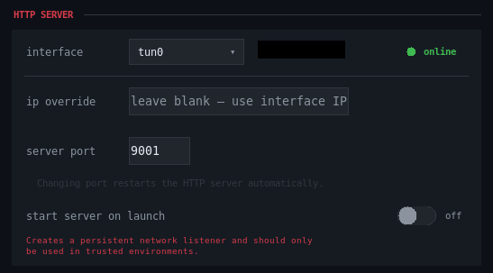
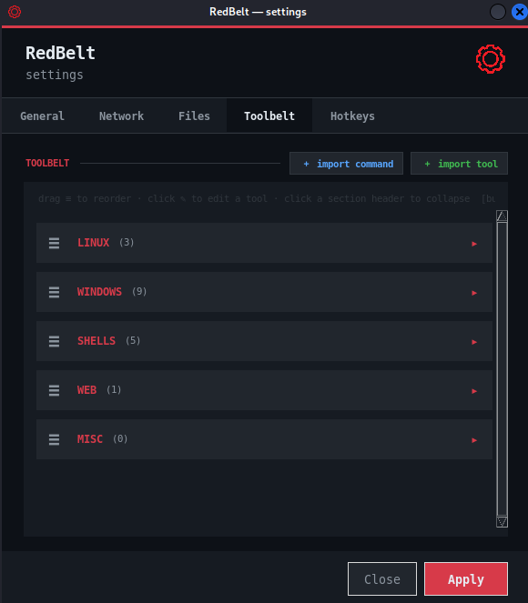
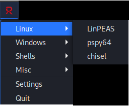
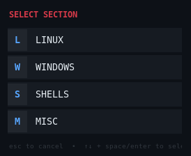

# Redbelt

Redbelt is a lightweight operator workflow tool for penetration testers and red team operators, designed to centralise and accelerate common offensive workflows from a single interface. It combines a tray interface, configurable hotkeys, local payload hosting and listener helpers into one focused toolkit.

Redbelt is highly configurable. It ships with example tools and workflows, but is designed to enhance your process rather than enforce a specific methodology.

> Built for authorized security testing and red team operations. Use responsibly and only in environments where you have explicit permission.


## Why Redbelt?

In fast-moving engagements, switching between tooling, payload hosting and listener setup can be distracting. Redbelt reduces that friction by giving you:

- Integrated listener management for reverse shells
- Local HTTP serving for payloads and scripts from the tools directory
- Hotkey launch support with configurable keys
- Clipboard command generation for rapid execution on target systems
- Template-based command generation with automatic listener and HTTP variable substitution
- Preferred network interface selection for VPN and tunnel adapters


## Features

- Tray launcher interface for rapid command and tool execution
- Keyboard-driven workflow with fast, configurable hotkeys for tools and sections
- Configurable tool catalog stored in config/config.json
- Tool importing, editing and removal through the settings interface
- Optional automatic HTTP server startup and listener startup
- Notification support for clipboard, listener, and HTTP events
- Start-on-login support for repeat use in daily workflows
- Optional automatic shell stabilisation with platform detection, configurable terminal setup and TTY resizing
- Optional automatic terminal opening when listener connections are received

## Included Tool Examples

Redbelt ships with a starter toolkit covering common enumeration, post-exploitation and workflow tasks. Included tools currently include:

### Linux
- LinPEAS
- pspy64
- Chisel

### Windows
- WinPEAS x86
- WinPEAS x64
- Chisel
- nc.exe
- nc64.exe
- SharpHound
- PowerView
- Invoke-Rubeus
- Mimikatz

### Shells
- Bash reverse shell templates
- BusyBox nc reverse shell template
- PowerShell reverse shell templates

### Web
- LFI fuzzing helper templates

The tool catalogue is fully customisable, allowing operators to add their own commands, payloads and internal tooling.


## Screenshots

A few views of the interface are included below:



Network configuration lets you set the HTTP interface, IP, and port used by the local server.



Tool management covers importing, removing, and editing tools in the catalog for fast workflow customization.



The tray menu provides quick access to the main actions, tool shortcuts, and service controls from the system tray.



The hotkey launch menu appears when you trigger the leader chord, allowing you to browse and launch tools instantly with Ctrl+Alt+Space.


## Getting Started

### Requirements

Redbelt is built with Python and the following dependencies:

- pystray
- pyperclip
- Pillow
- pynput

Use the initialisation script to install them and run the program automatically:

```bash
./run.sh
```

Or install them manually:

```bash
python3 -m venv .venv
source .venv/bin/activate
pip install -r requirements.txt
```

### Running the app

```bash
python main.py
```

The application will start in the background tray and begin the configured services automatically based on your settings.


## Configuration

Redbelt can be configured through the built-in settings UI or directly through config/config.json. The UI is intended for day to day changes, while the JSON file provides deeper customization and tool catalog management.

Common configuration areas include:

- HTTP and listener settings
- Preferred network interfaces and addresses
- Tool definitions, nicknames, hotkeys and command templates
- Automatic IP and port substitution for tool commands
- Hotkey launch behavior, leader keys and launch timing
- Shell stabilisation preferences
- Startup, notification, and tray preferences


You can customise the available commands by editing the `tools` section in [config/config.json](config/config.json), or by using the settings interface for the most common options. Commands support dynamic placeholders such as `{IP}` and `{PORT}`, allowing tools and payloads to automatically adapt to the configured HTTP server or listener settings.

The tool catalog is intentionally flexible. You can populate it with anything that fits your workflow, such as Python or Bash shell stabilisation one-liners, common web exploitation command templates, Active Directory enumeration commands, payload download helpers or your own internal tooling. Redbelt doesn't impose a specific methodology—the workflow is entirely yours to customise.


## Usage Workflow

1. Launch Redbelt from the terminal or your desktop environment.
2. Use the tray menu or configured hotkeys to access tools by category.
3. Copy or launch payloads and commands directly from the UI.
4. Let Redbelt manage local HTTP hosting, listener setup and optional automatic shell stabilisation based on your configuration.

The default launch chord is configurable and the app supports a structured flow such as:

- Leader key → section selection → tool selection → command execution


## Project Structure

```text
redbelt/
├── config/           # Configuration loading and runtime settings
├── services/         # Tray, hotkeys, HTTP, and listener services
├── settings/         # UI settings windows and tabs
├── tools/            # Payloads and helper binaries served by the app
├── utils/            # Networking and utility helpers
├── main.py           # Application entry point
└── requirements.txt  # Python dependencies
```


## Notes

This project is intentionally focused and practical rather than a general-purpose framework. Redbelt aims to streamline common red team and pentest tasks without requiring heavy setup while remaining adaptable through configurable tools, listeners, network preferences and shell handling behaviour.

If you want to extend it, the easiest places to start are the tool definitions in [config/config.json](config/config.json) and the service modules in [services](services).
